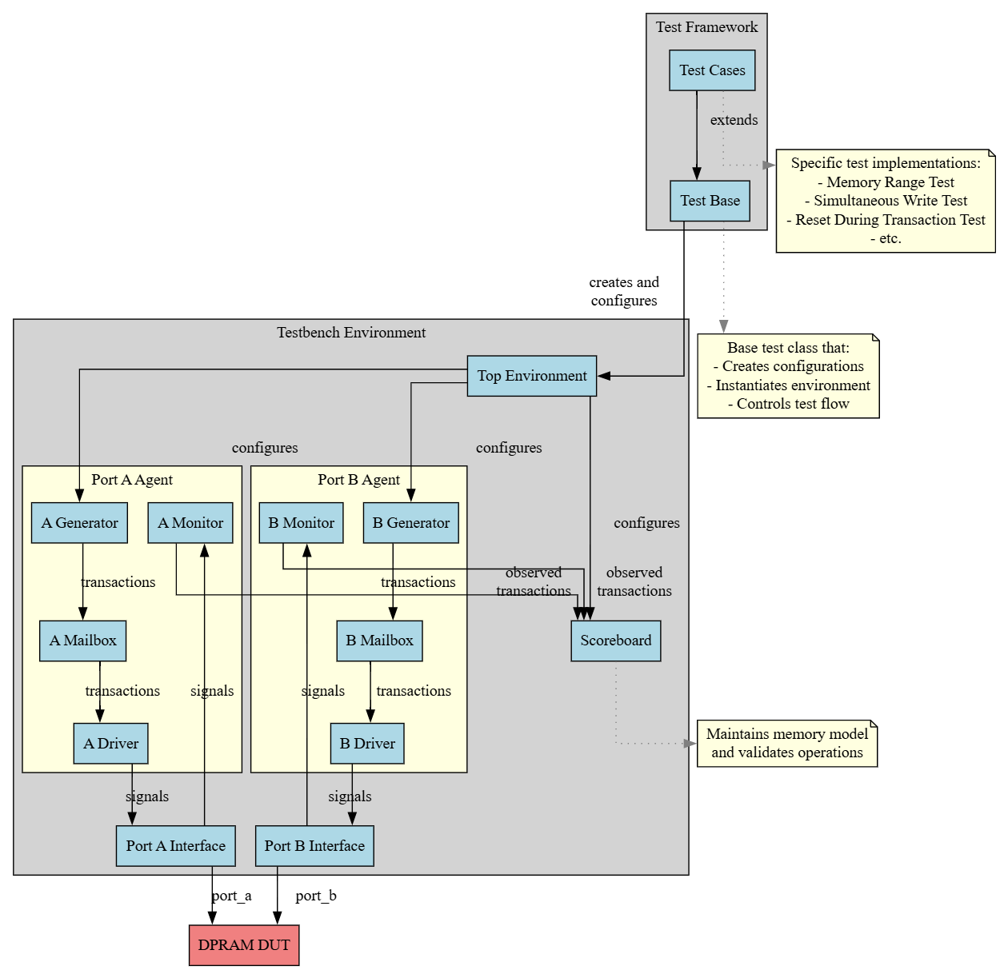
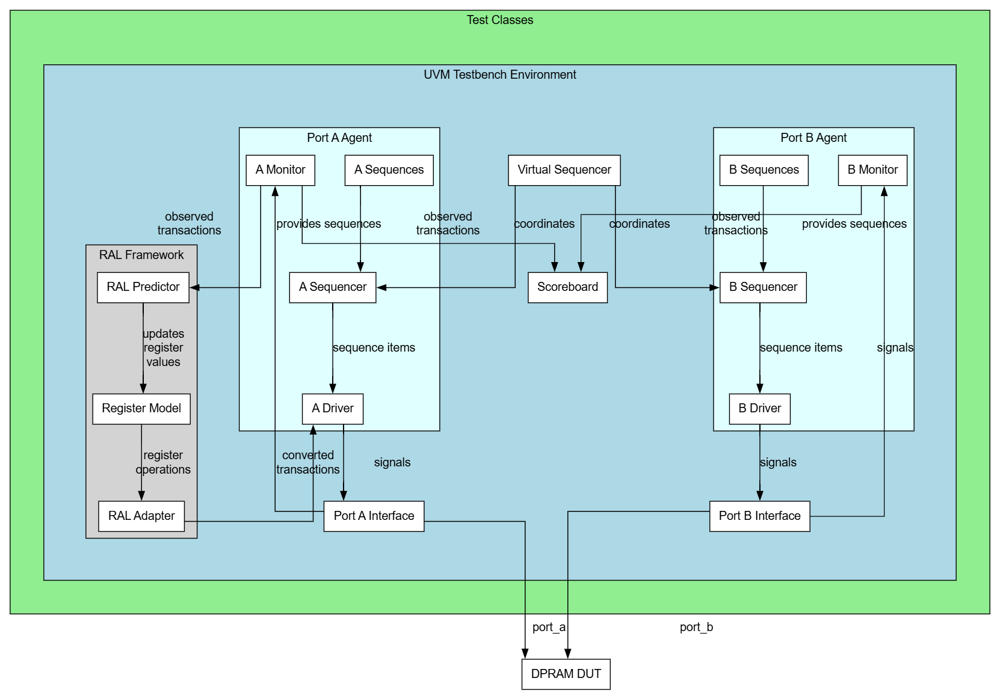

# dual-port-ram-verification
A dual port RAM verification project with valid-ready protocol environment implemented in both SystemVerilog and UVM methodologies.

## Project Structure

This project contains two verification approaches:

- **sv_verification/**: Traditional SystemVerilog verification environment with custom testbench components including generators, drivers, monitors, and scoreboard
- **uvm_verification/**: Universal Verification Methodology (UVM) based environment with standardized components, sequences, agents, and comprehensive coverage model

Both environments verify the same dual-port RAM DUT with identical test scenarios to ensure thorough validation across different verification methodologies.

## Testbench Architecture
### SystemVerilog Testbench Architecture

---
### UVM Testbench Architecture with RAL

## Test Scenarios

| Test Case | Name | Goal/Description | SV Status | UVM Status |
|-----------|------|-----------------|---------|------------|
| single port write/read operation ( port A) | basic_write_read_porta | Goal: verify basic write and read operations on  port A write random data and address read from the same address verify that read data equals previously written data | <ul><li>- [x] </li></ul> | <ul><li>- [ ] </li></ul> |
| singe port write/read operation (port B) | basic_write_read_portb | Goal:  verify basic write and read operations on port B write random data and address read from the same address verify that read data equals previously written data | <ul><li>- [x] </li></ul> | <ul><li>- [ ] </li></ul> |
| basic write/read different ports | basic_porta_write_portb_read | Goal: ensure memory consistency across ports select  port A for writing and port B for reading write random data and random address on  port A read data at the same address on port B check if data written from  port A is the same as the data read from port B |<ul><li>- [x] </li></ul> | <ul><li>- [ ] </li></ul> |
| fill entire memory | fill_memory | Goal: test the ability of the memory to access all addresses write random data on all addresses: minimum address up to max read from the minimum addresses up to max, check written data is equal to ones read |<ul><li>- [x] </li></ul> | <ul><li>- [ ] </li></ul> |
| fill memory with  port A, read entire memory with port B | fill_memory_porta_write_portb_read | Goal: test ability of  port A to fill memory and port B to read all memory Write to all memory locations through Port A Read all memory locations through port B check if written data is equal to read data |<ul><li>- [x] </li></ul> | <ul><li>- [ ] </li></ul> |
| fill memory with port B, read entire memory with  port A | fill_memory_portb_write_porta_read | Goal: test ability of port B to fill memory and  port A to read all memory Write to all memory locations through port B Read all memory locations through Port a check if written data is equal to read data |<ul><li>- [x] </li></ul> | <ul><li>- [ ] </li></ul> |
| fill memory with  port A, read entire memory with  port A | fill_memory_porta_write_porta_read | Goal: test ability of port B to fill memory and  port A to read all memory Write to all memory locations through Port a Read all memory locations through Port a check if written data is equal to read data |<ul><li>- [x] </li></ul> | <ul><li>- [ ] </li></ul> |
| fill memory with port B, read entire memory with port B | fill_memory_portb_write_portb_read | Goal: test ability of port B to fill memory and  port A to read all memory Write to all memory locations through port B Read all memory locations through port B check if written data is equal to read data |<ul><li>- [x] </li></ul> | <ul><li>- [ ] </li></ul> |
| simultaneous read from different addresses | simultaneous_read_different_address | Goal: test ability of memory to handle reads from both ports simultaneously read address from  port A read different address from port B at same cycle verify the read data is consistent and have not changed |<ul><li>- [x] </li></ul> | <ul><li>- [ ] </li></ul> |
| simultaneous write to differnt addreses | simultaneous_write_different_address | Goal: test ability of memory to handle writes from both ports simultaneously write to random address from  port A write to different address from port B at same cycle read data written and verify that it's consistent |<ul><li>- [x] </li></ul> | <ul><li>- [ ] </li></ul> |
| simultaneous write to the same address | simultaneous_write_same_address | Goal: check the behaviour of memory with collisions write to address , random data on  port A write to same address , random data , on port B at same cycle Read same address verify arbitration logic |<ul><li>- [x] </li></ul> | <ul><li>- [ ] </li></ul> |
| simultaneous write and read to the same address | simultaneous_write_read_same_address | Goal: ensure consistency accessing data with different modes of operation write random data to an address on  port A read same address at the same cycle on port B ensure that the new value has been read |<ul><li>- [x] </li></ul> | <ul><li>- [ ] </li></ul> |
| out of range memory access | out_of_range_memory_access | Goal: check for out of range access handling write on illegal address read from the same illegal address check if illegal range access affects memory |<ul><li>- [x] </li></ul> | <ul><li>- [ ] </li></ul> |
| reset test | reset_test | Goal: write random data and random address apply reset read same address should read default 0 value from memory |<ul><li>- [x] </li></ul> | <ul><li>- [ ] </li></ul> |
| back to back writes on  port A | B2B_writes_porta | Goal: test handling of continous writing on memory from  port A write random data with random address from port B continously verify correct data and arbitration |<ul><li>- [x] </li></ul> | <ul><li>- [ ] </li></ul> |
| back to back writes on port B | B2B_writes_portb | Goal: test handling of continous writing on memory from port B write random data with random address from port B continously verify correct data and arbitration |<ul><li>- [x] </li></ul> | <ul><li>- [ ] </li></ul> |
| back to back reads on  port A | B2B_reads_porta | Goal: test handling of continously reading memory from  port A read random address from  port A continously verify correct data and arbitration |<ul><li>- [x] </li></ul> | <ul><li>- [ ] </li></ul> |
| back to back reads on port B | B2B_reads_portb | Goal: test handling of continously reading memory from port B read random address from port B continously verify correct data and arbitration |<ul><li>- [x] </li></ul> | <ul><li>- [ ] </li></ul> |
| back to back transactions on both ports | B2B_transactions_both_ports | Goal: test continuous transactions on memory from both ports random read or write put random data on memory with random addresses check if reference model has the same data as the memory |<ul><li>- [x] </li></ul> | <ul><li>- [ ] </li></ul> |

